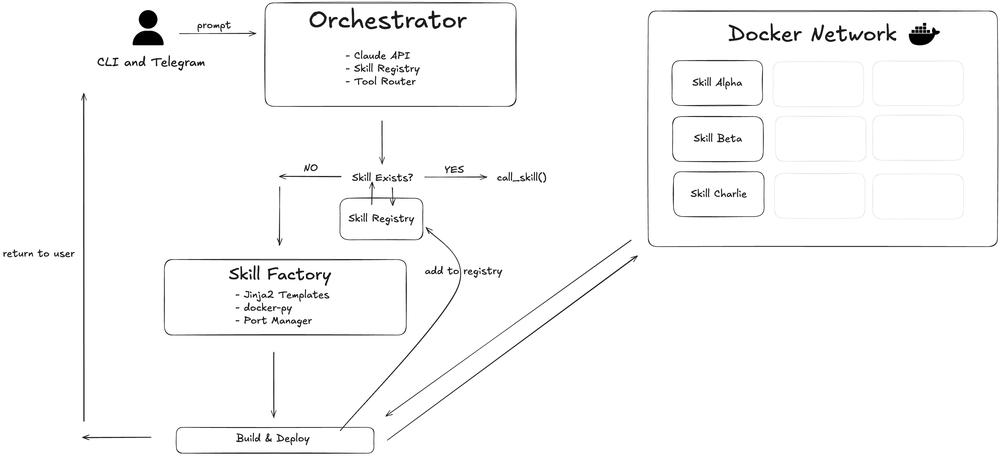
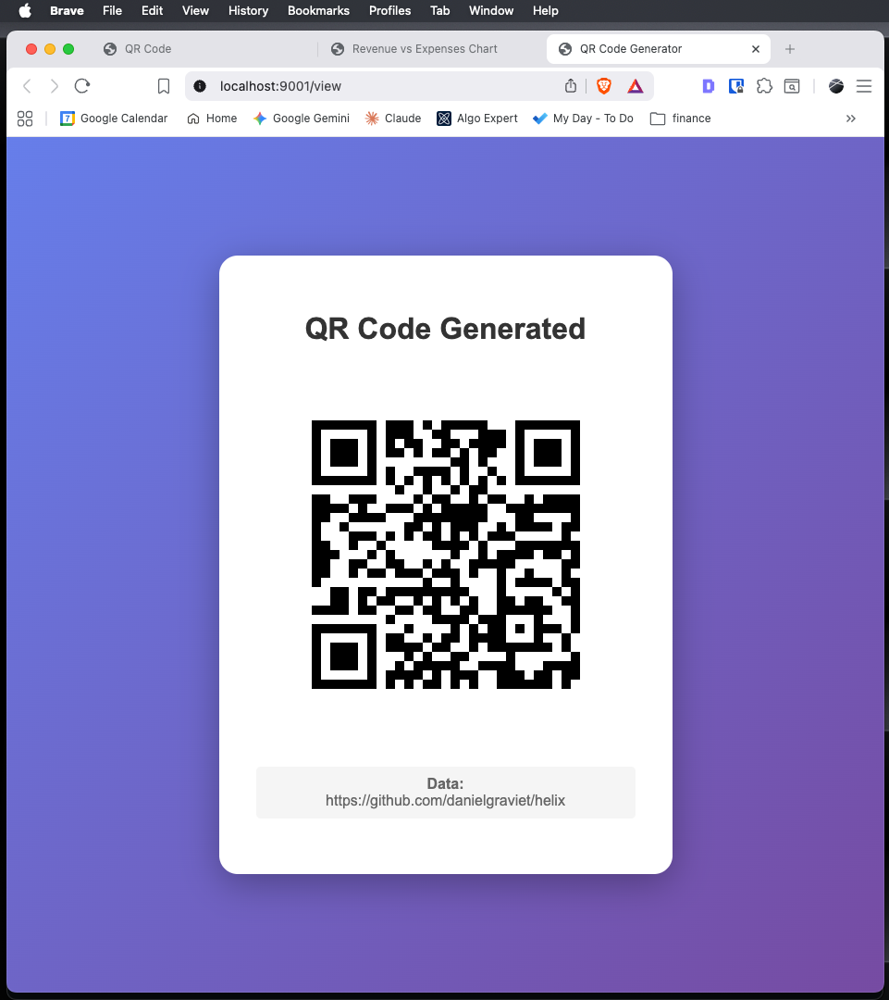
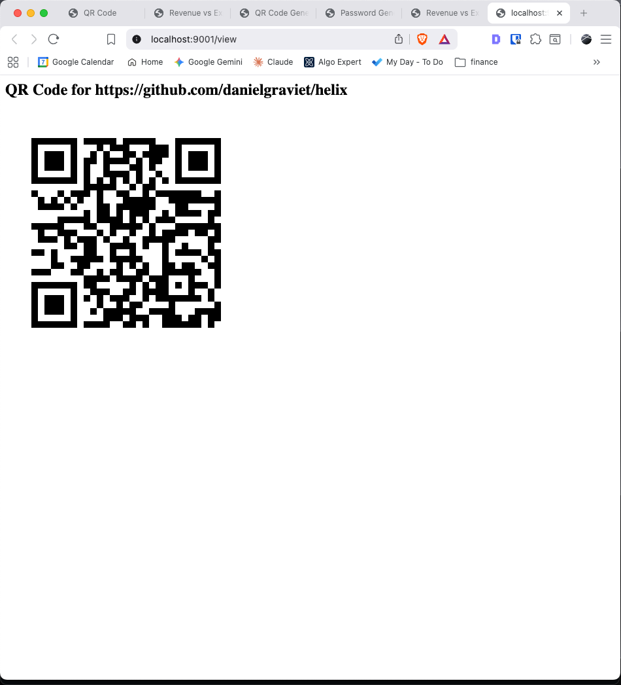
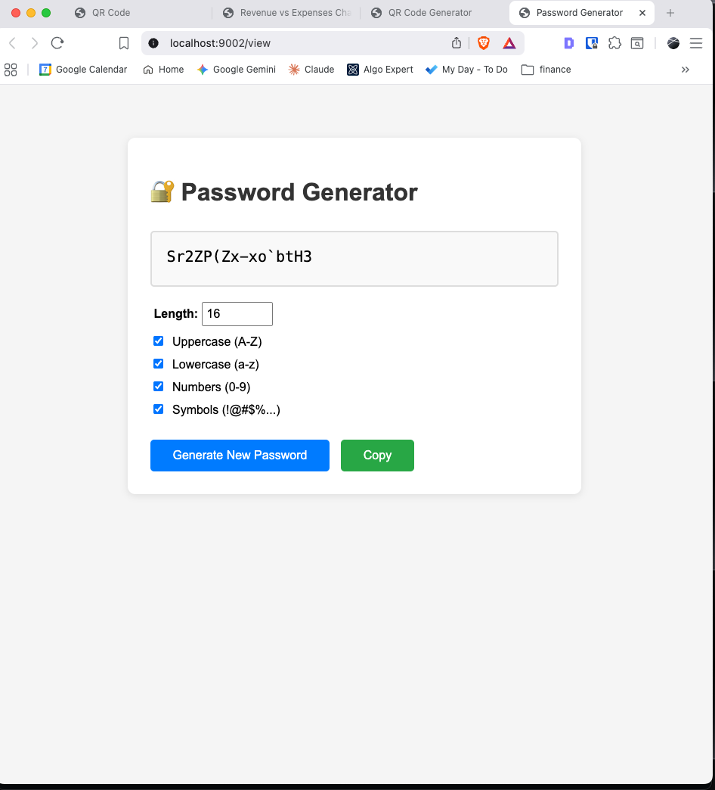
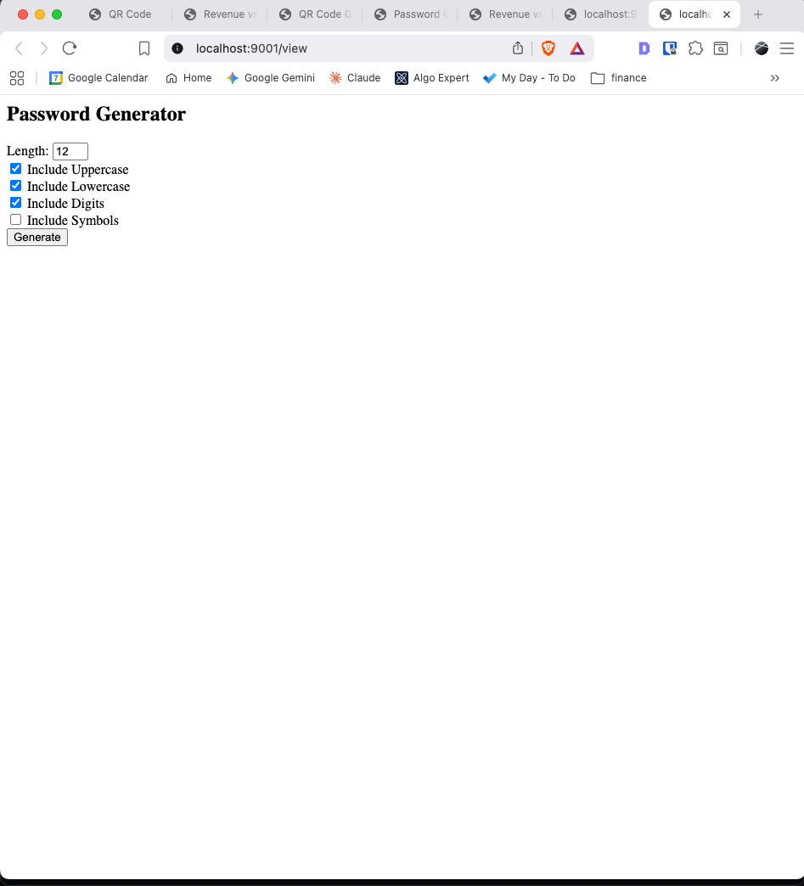
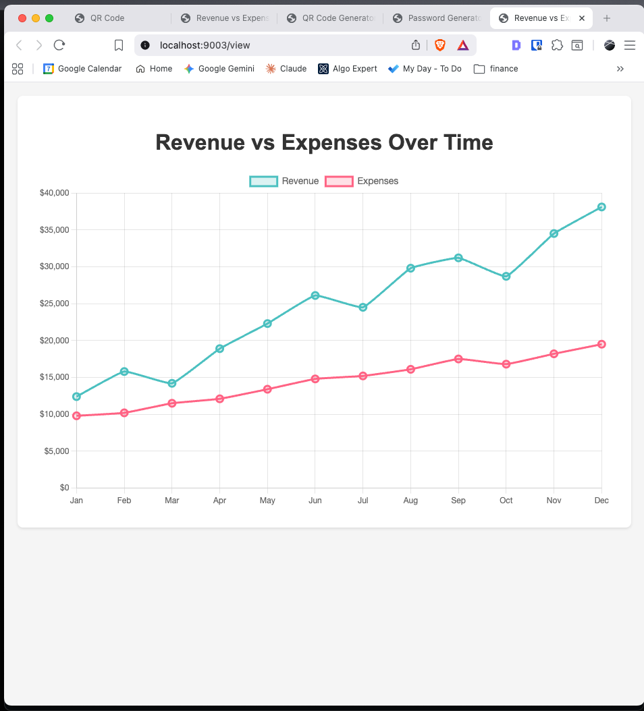
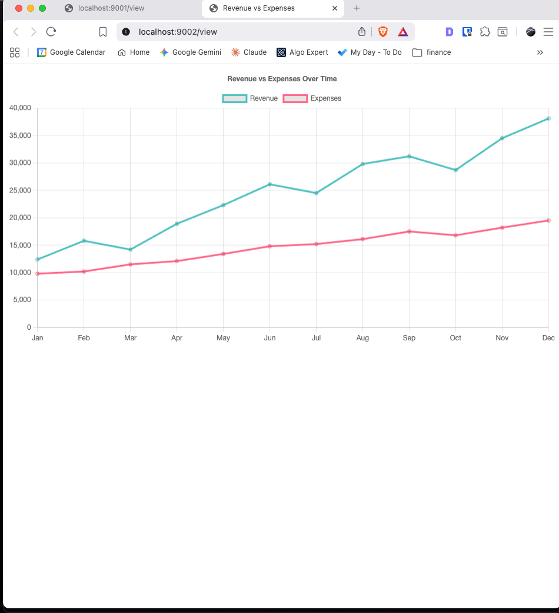
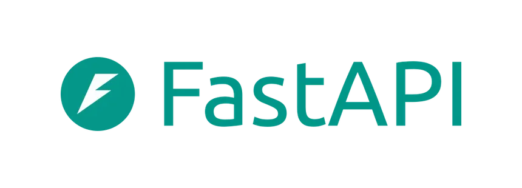
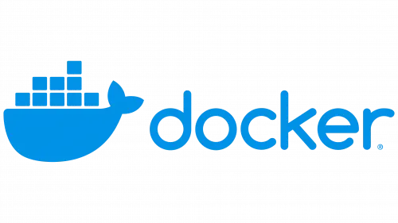
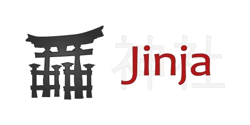

# Helix
```text
#########################################################################
#                                            __                         #
#   _   _  _____ _      _____  __           /  \      Helix             #
#  | | | || ____| |    |_ _\ \/ /          / /\ \     v1.0.0            #
#  | |_| ||  _| | |     | | \  /          | |  | |    --------------    #
#  |  _  || |___| |___  | | /  \           \ \/ /     [STATUS: ACTIVE]  #
#  |_| |_||_____|_____||___/_/\_\           \  /                        #
#                                           /  \                        #
#   Skills that evolve on demand.          / /\ \                       #
#                                         | |  | |                      #
#                                          \ \/ /                       #
#                                           \  /                        #
#                                            \/                         #
#########################################################################
```
**Skills that evolve on demand.**

Helix is a self-extending AI agent. Give it a task, and it will check if it already has the right skill — if not, it writes the code, builds a Docker container, deploys it as a microservice, and calls it to return your result. Each skill persists and is reusable for future tasks.

---

## How It Works


## Provider Comparison

Helix supports multiple LLM providers. We ran the same three prompts through **Claude** and **GPT OSS** to compare the skills each model generated.

### QR Code Generator
| Claude | GPT OSS |
|:---:|:---:|
|  |  |

### Password Generator
| Claude | GPT OSS |
|:---:|:---:|
|  |  |

### Data Visualization
| Claude | GPT OSS |
|:---:|:---:|
|  |  |

---

## Project Structure

```
helix/
├── main.py                  # CLI entry point
├── config.py                # Centralized settings (env vars, constants)
├── orchestrator/
│   ├── agent.py             # Claude API loop + tool definitions
│   └── registry.py          # In-memory skill registry
├── skill_factory/
│   ├── factory.py           # Code generation + Docker build/run
│   ├── port_manager.py      # Dynamic port allocation
│   └── templates/
│       └── fastapi_skill/
│           ├── main.py.j2   # Jinja2 template for skill code
│           └── Dockerfile.j2
├── models/
│   └── skill.py             # Skill and SkillSpec Pydantic models
├── integrations/
│   └── telegram_bot.py      # Telegram bot interface
└── e2e/                     # End-to-end tests
```

---

## Quick Start

### Prerequisites

- Python 3.13+
- Docker (running)
- [uv](https://docs.astral.sh/uv/) package manager
- Anthropic API key

### Setup

```bash
# Clone and install dependencies
git clone https://github.com/danielgraviet/helix.git
cd helix
uv sync

# Create Docker network
docker network create agent-net

# Pre-pull base image (speeds up first skill build)
docker pull python:3.12-slim

# Set environment variables
cp .env.example .env
# Add your ANTHROPIC_API_KEY to .env
```

### Run the CLI

```bash
uv run python -m main
```

### OR run the Telegram Bot

```bash
# Add TELEGRAM_BOT_TOKEN to your .env file
uv run python -m integrations.telegram_bot
```

---

## Commands

### CLI

| Command | Action |
|---|---|
| Type any task | Helix creates/calls skills to solve it |
| `quit` / `exit` | Shut down and clean up containers |

### Telegram Bot

| Command | Action |
|---|---|
| `/start` | Introduction |
| `/skills` | List active skills |
| `/clear` | Remove all skills and containers |
| Any message | Helix processes the task |

---

## Configuration

All settings live in `config.py`:

| Setting | Default | Description |
|---|---|---|
| `MODEL` | `claude-sonnet-4-5-20250929` | Claude model for the agent loop |
| `MAX_TOKENS` | `4096` | Max response tokens |
| `DOCKER_NETWORK` | `agent-net` | Docker bridge network for skills |
| `SKILL_BASE_IMAGE` | `python:3.12-slim` | Base image for skill containers |
| `PORT_RANGE_START` | `9001` | Start of dynamic port range |
| `PORT_RANGE_END` | `9100` | End of dynamic port range |
| `MAX_BUILD_RETRIES` | `3` | Retry attempts for failed builds |
| `CONTAINER_TIMEOUT` | `60` | Build/run timeout (seconds) |
| `SKILL_STARTUP_TIMEOUT` | `15` | Max wait for /health (seconds) |

---

## Tech Stack

<p align="center">
  &nbsp;&nbsp;
  &nbsp;&nbsp;
  &nbsp;&nbsp;
  &nbsp;&nbsp;
  
</p>

- **Agent**: Claude API (Anthropic) with native tool use
- **Skill Runtime**: FastAPI + uvicorn in Docker containers
- **Templating**: Jinja2
- **Container Management**: docker-py SDK
- **CLI Output**: Rich
- **Telegram**: python-telegram-bot
- **Models**: Pydantic
